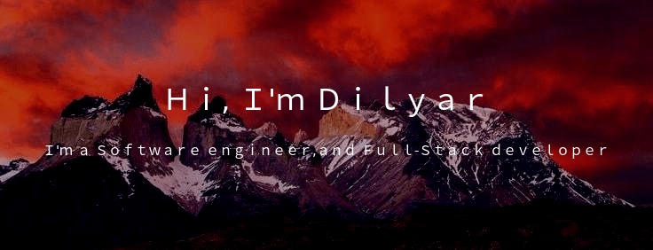

<!--  https://Dilyar0.github.io/portfolio/  -->
<!-- 

 

 -->

#### Briefly about me:

- ❤️‍🔥 I like to write code
- 🤓 love to learn something new
- ⌚️ In my free times I like to read books
- 🚗🏎🏍 Motor-car enthusiast

  

<h2 align="center"> Technology Stack 
</h2>

 

 
<!-- 
<h2 align="center">
  My Contribution Graph 
</h2>

  

 -->

<h2 align="center">
  My Github Stats
</h2>
 
 

  
  

 

 

 

 

<h2 align="center">Reach me out on </h2>

<h2 align="center">
    
    
</h2>

 

never give up, great things take time⌚🤓😈

